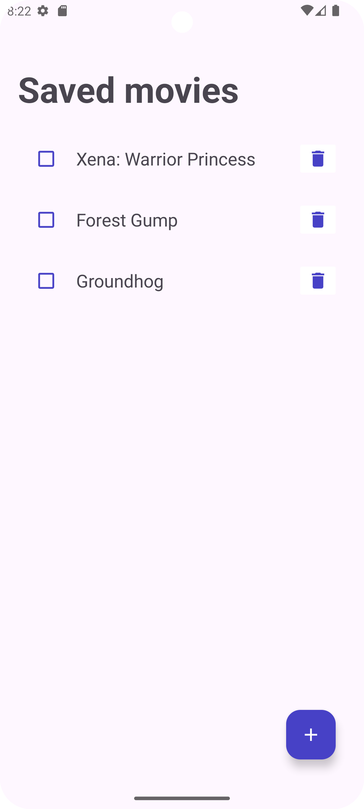

# MovieList

_Read this in other language: [English](README.md), [Русский](README.ru.md)_

## Project Description

This app was created as a pet project to improve skills.

The application is implemented to record the desired movies to watch, so as not to forget about them. You can also mark if something has already been viewed.

## Feature List

- Replenishment of the list
- Mark viewed
- Delete unnecessary movies

## Demo

## Frameworks and technologies used

* Description: Java is a strongly typed general-purpose object-oriented programming language developed by Sun Microsystems (later acquired by Oracle). Development is conducted by a community organized through the Java Community Process; the language and the main technologies implementing it are distributed under the GPL license.
* Resources:
  * Official Website: [Official Website](https://www.java.com/ru/)
  * Documentation: [Documentation](https://docs.oracle.com/en/java/)

* Description: Android Studio is the official integrated development environment (IDE) for Google's Android operating system, built on JetBrains' IntelliJ IDEA software and designed specifically for Android development.
* Resources:
  * Official Website: [Official Website](https://developer.android.com/studio?hl=ru)
  * Documentation: [Documentation](https://developer.android.com/develop?skip_cache=true%22%22)

* Description: Firebase is a set of tools and services for the development of mobile and web applications from Google. With it, you can quickly deploy a backend with your own server logic, connect databases and configure user authorization. The platform is often used to create MVP and develop with limited resources.

* Resources:
  * Official Website: [Official Website](https://firebase.google.com/)
  * Documentation: [Documentation](https://firebase.google.com/docs?hl=ru)
