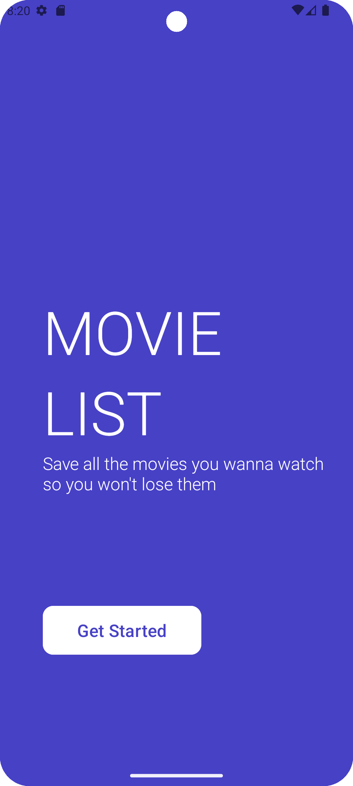

# MovieList

_Прочитать на другом языке: [English](README.md), [Русский](README.ru.md)_

## Описание проекта

Это приложение создано в качестве пэт-проекта для улучшения навыков.

Приложение реализовано для записи желаемых к просмотру фильмов, чтобы не забыть о них. Также можно отмечать, если что то уже просмотрено.

## Особенности

- Пополнение списка
- Отметка просмотренных
- Удаление ненужных фильмов
  
## Демо версия

## Используемые фреймворки и технологии

* Описание: Java - это строго типизированный объектно-ориентированный язык программирования общего назначения, разработанный Sun Microsystems (позже приобретенный Oracle). Разработка ведется сообществом, организованным в рамках процесса Java Community; язык и основные технологии, его реализующие, распространяются под лицензией GPL.
* Ресурсы:
  * Официальный сайт: [Official Website](https://www.java.com/ru/)
  * Документация: [Documentation](https://docs.oracle.com/en/java/)

* Описание: Android Studio - это официальная интегрированная среда разработки (IDE) для операционной системы Google Android, основанная на программном обеспечении IntelliJ IDEA от JetBrains и разработанная специально для разработки под Android.
* Ресурсы:
  * Официальный сайт: [Official Website](https://developer.android.com/studio?hl=ru)
  * Документация: [Documentation](https://developer.android.com/develop?skip_cache=true%22%22)
